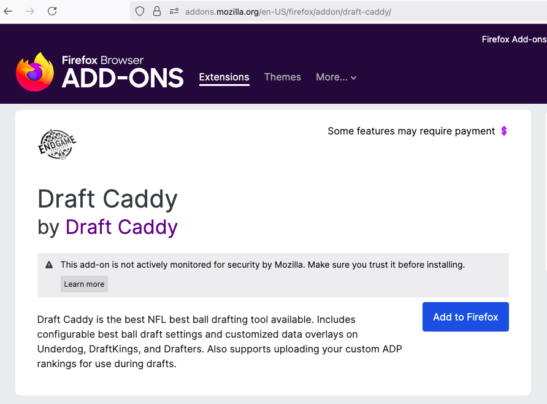
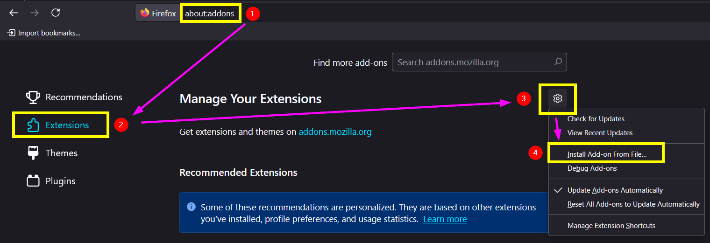
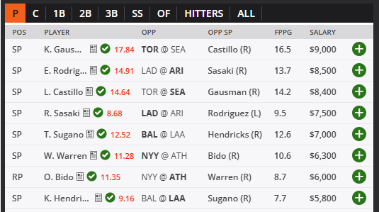

# Draft Caddy – DFS Draft Assistant Browser Extension

Draft Caddy is a browser extension designed to enhance your drafting experience on fantasy platforms like DraftKings, Underdog, and Drafters. It offers real-time data overlays, player exposure insights, and customizable settings to give you a competitive edge.

## Main Features

- Configurable NFL Best Ball settings for Underdog Fantasy, DraftKings, and Drafters that guide the user during drafts.
- Combo player ownership projections for Best Ball Mania.
- Supports custom ADP inputs.
- Shows player matchup data and personal exposure percentages during live drafts.
- Embedded MLB DFS projections powered by [Run The Sims](https://runthesims.com/subscribe).

## Subscribing for Draft Caddy Access

- Full Draft Caddy access, including NFL bestball and MLB DFS, at [Endgame Syndicate](https://endgamesyndicate.com/draft-caddy/)

- Subscribe for access to DraftKings and Underdog MLB Projections at [Run The Sims](https://runthesims.com/subscribe)

## Requirements
  

- Active Draft Caddy [Endgame Syndicate](https://endgamesyndicate.com/draft-caddy/) or MLB Draft Caddy [Run The Sims](https://runthesims.com/subscribe) subscription
- Google Chrome or Microsoft Edge v135.0+ or Mozilla Firefox 135.0+

## Installation Instructions

### Mozilla Firefox

  

#### Firefox Automatic Install

1. Open Firefox
2. Go to the [Mozilla Add-ons Store Draft Caddy page](https://addons.mozilla.org/en-US/firefox/addon/draft-caddy/).
3. Choose **Add to Firefox**
4. Accept the permissions prompt

#### Firefox Manual Install

1. Open Firefox
2. Download the extension ZIP file from the [latest release](https://github.com/runthesims/Draft-Caddy-Releases/releases)
3. Open the Firefox Add-ons Manager
    - Firefox > Hamburger Menu (top right) > Settings > Extensions & Themes (bottom left) > Extensions
    - OR type `about:addons` directly into the address bar to go directly to the Add-ons Manager
4. Click the **Gear** icon
5. Choose **"Install Add-on From File"** and select the downloaded installer.

### Google Chrome or Microsoft Edge

> [!NOTE]
> Draft Caddy is not currently available in the Chrome Web Store. Follow these steps to install it manually:

1. Download the extension ZIP file from the [latest release](https://github.com/runthesims/Draft-Caddy-Releases/releases).
2. Unzip the file to a new folder on your computer.
3. Open Chrome/Edge and click on the three dots in the top-right corner to access the menu.
4. Navigate to **Extensions** > **Manage Extensions**
5. Enable **Developer mode** using the toggle in the top-right corner (Chrome) or left sidebar (Edge).
6. Click on **"Load unpacked"** and select the folder where you unzipped the extension. Ensure that the folder contains the `manifest.json` file.

> [!WARNING]
> If you're updating to the latest version, delete the old version and remove it from Chrome/Edge before installing the update.

## MLB Draft Caddy

Embeds MLB projections into DraftKings draft pages (shown in red in below image).

---

For more information, support, or to subscribe, visit the [Draft Caddy page](https://endgamesyndicate.com/draft-caddy/).
