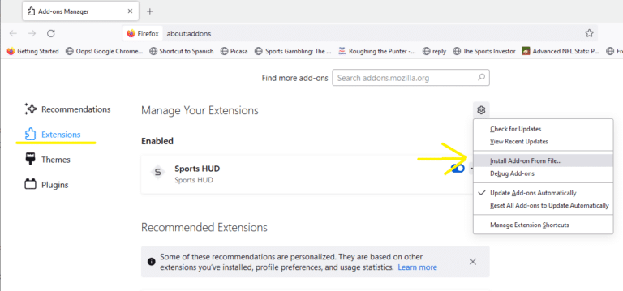

# Draft Caddy – DFS Draft Assistant Browser Extension

Draft Caddy is a browser extension designed to enhance your drafting experience on fantasy platforms like DraftKings, Underdog, and Drafters. It offers real-time data overlays, player exposure insights, and customizable settings to give you a competitive edge.

## Subscribing for Draft Caddy Access

Subscribe for base Draft Caddy access at [Endgame Syndicate](https://endgamesyndicate.com/draft-caddy/)

Subscribe for access to MLB Projections at [RunTheSims](https://runthesims.com/subscribe)

## Installation Instructions

### Mozilla Firefox

1. Download the installer from the [Mozilla Add-ons Store](https://addons.mozilla.org/en-US/firefox/addon/draft-caddy/).
2. Navigate to the Firefox extensions page.
3. Choose **"Install Add-on From File"** and select the downloaded installer.

### Google Chrome

> [!NOTE]
> Draft Caddy is not currently available in the Chrome Web Store. Follow these steps to install it manually:

1. Download the extension ZIP file from the [latest release](https://github.com/runthesims/Draft-Caddy-Releases/releases).
2. Unzip the file to a new folder on your computer.
3. Open Chrome and click on the three dots in the top-right corner to access the menu.
4. Navigate to **More Tools** > **Extensions**.
5. Enable **Developer mode** using the toggle in the top-right corner.
6. Click on **"Load unpacked"** and select the folder where you unzipped the extension. Ensure that the folder contains the `manifest.json` file.

> [!WARNING]
> If you're updating to the latest version, delete the old version and remove it from Chrome before installing the update.

---

For more information, support, or to subscribe, visit the [Draft Caddy page](https://endgamesyndicate.com/draft-caddy/).
